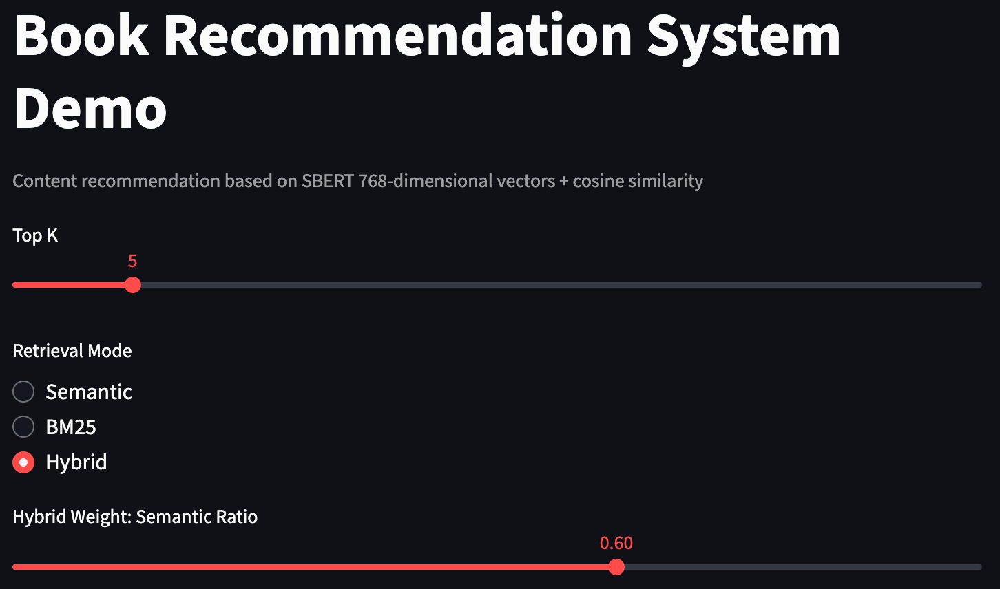
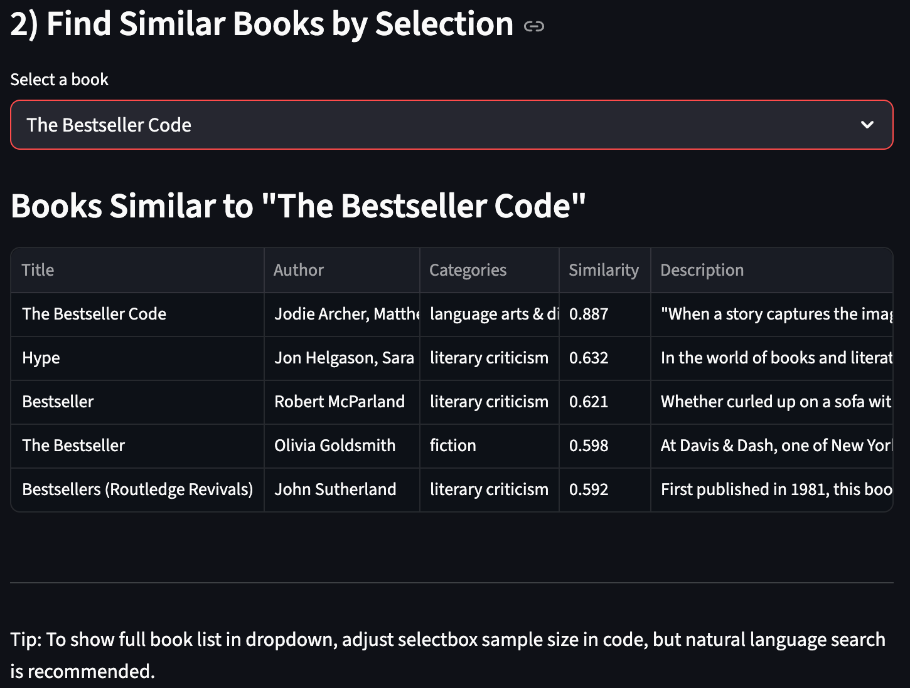

# Book Recommendation System: A Hybrid Semantic and Keyword-Based Approach


## Table of Contents

[TOC]

## Project Repository

GitHub Repository: https://github.com/InftyMing/NTU-AAI-A6000-Book-Recommendation-System/tree/main


## Team Members

- Ming Sun (Email: MING005@e.ntu.edu.sg, StudentID: G2509034C)
- Fang Gao (Email: FANG014@e.ntu.edu.sg, StudentID: G2509276D)


## Dataset Overview

### Data Source and Characteristics

The dataset utilized in this project originates from Kaggle, specifically the repository `mihikaajayjadhav/books-dataset-15k-books-across-100-categories`. The complete dataset can be accessed at https://www.kaggle.com/datasets/mihikaajayjadhav/books-dataset-15k-books-across-100-categories.

Data acquisition was performed programmatically using the `kagglehub.dataset_download` utility, resulting in a CSV file stored at `data/raw/google_books_dataset.csv`. The raw dataset comprises 15,147 bibliographic records, each containing 21 distinct attributes. Key attributes include book titles, subtitles, author information, detailed descriptions, categorical classifications, average ratings, rating counts, search categories, and thumbnail image URLs.

### Data Preprocessing Pipeline

The preprocessing stage involved several critical transformations to ensure data quality and prepare the corpus for downstream tasks:

1. **Duplicate Elimination**: Records were deduplicated using the `book_id` field as the unique identifier, ensuring each book appears only once in the processed dataset.

2. **Handling Missing Values**: Textual fields including `title`, `subtitle`, `authors`, `description`, `categories`, and `search_category` were processed to replace missing values with empty strings. Additionally, leading and trailing whitespace was systematically removed from all text fields.

3. **Semantic Text Assembly**: A composite text field was constructed by concatenating title, subtitle, and description fields: `text = title + subtitle + description`. To filter out low-quality entries, only records with text length exceeding 50 characters were retained, effectively removing noise and extremely brief descriptions.

4. **Category Processing**: The `categories` field underwent sophisticated parsing using regular expressions to split on multiple delimiters (`|`, `/`, `,`, `;`). Each category token was normalized to lowercase and stripped of whitespace, resulting in a structured `category_list`. The first category in each list was designated as the `primary_category` for simplified classification.

5. **Field Retention**: The final processed dataset preserves the following fields: `book_id`, `title`, `subtitle`, `authors`, `description`, `categories`, `category_list`, `primary_category`, `text`, `average_rating`, `ratings_count`, and `search_category`.

6. **Final Output**: After preprocessing, 10,625 valid book records were retained and persisted in Parquet format at `data/processed/books.parquet`, representing approximately 70% of the original dataset.


## Technical Architecture and Methodology

### Semantic Embedding Model Selection

**Chosen Model**: The `sentence-transformers/all-mpnet-base-v2` model was selected as the primary semantic encoder, producing 768-dimensional dense vector representations.

**Architectural Foundation**: This model leverages the MPNet (Masked and Permuted Pre-training) architecture, which synthesizes the strengths of BERT's bidirectional context understanding and XLNet's permutation-based training paradigm. The model demonstrates superior performance on standard benchmarks including Semantic Text Similarity (STS) tasks and semantic search evaluations.

**Technical Specifications**: 
- Maximum input sequence length: 384 tokens, making it well-suited for processing book descriptions and metadata
- Model size: Approximately 110 million parameters
- Performance characteristics: Achieves an optimal trade-off between computational efficiency and representation quality

**Rationale for Selection**:
- Demonstrated excellence on semantic similarity benchmarks while maintaining reasonable computational overhead
- Processing throughput of approximately 100 samples per second when using batch size of 64
- Exhibits robustness across varying text lengths in English corpora
- Enables local deployment without dependency on external API services, thereby reducing operational costs and eliminating network latency

**Comparative Analysis with Alternative Models**:
- **all-MiniLM-L12-v2**: While more lightweight at 80M parameters, this model exhibits approximately 3-5% degradation in accuracy metrics despite maintaining 768-dimensional outputs
- **Large Language Model APIs** (e.g., OpenAI text-embedding-3-large): These solutions require external service dependencies, introduce significant cost overhead, and present challenges for local deployment and data privacy compliance
- **Multilingual Models** (e.g., `distiluse-base-multilingual-cased`): While offering superior cross-lingual capabilities, these models show reduced performance on English-specific tasks compared to mpnet, which is optimal for our English-language book dataset

### Vector Similarity Computation and Indexing

**Similarity Metric Implementation**: 
The system employs L2 normalization to project all embedding vectors onto a unit hypersphere, followed by inner product computation through FAISS's `IndexFlatIP` index structure. This approach is mathematically equivalent to cosine similarity, as demonstrated by the identity: `cos(θ) = (A·B) / (||A|| ||B||) = A_norm · B_norm` when vectors are normalized.

**Index Architecture**:
- **Index Type**: FAISS `IndexFlatIP` provides exact nearest neighbor search without requiring index training
- **Storage Requirements**: With 768-dimensional vectors for 10,625 records, the embedding matrix consumes approximately 32MB of memory (calculated as 10,625 × 768 × 4 bytes per float32)
- **Query Performance**: In-memory index operations achieve sub-10ms latency for individual queries

**Advantages of This Approach**:
- High computational efficiency through optimized vector operations
- Minimal memory footprint suitable for datasets under 100,000 records
- Straightforward implementation without complex index tuning requirements

### Hybrid Retrieval Framework

**BM25 Component**:
The system incorporates the classic BM25 ranking algorithm through the `rank-bm25` library implementation. Tokenization employs a straightforward English-language strategy: preserving alphanumeric characters, splitting on whitespace boundaries, and converting all tokens to lowercase. This approach excels at capturing exact keyword matches and term frequency patterns, providing complementary signals to semantic similarity measures.

**Score Fusion Methodology**:
The hybrid retrieval system combines semantic and keyword-based scores through linear weighted combination: `final_score = α × semantic_score + (1 - α) × bm25_score`, where α defaults to 0.6, indicating 60% weight on semantic signals and 40% on keyword matching.

**Normalization Strategy**: To ensure score compatibility, both semantic and BM25 scores undergo independent maximum normalization before fusion. The system retrieves Top-3K candidates from each retrieval pathway, performs deduplication, and re-ranks the merged candidate set by fused scores to produce the final Top-K results.

**Synergistic Benefits**:
- **Semantic Component**: Captures conceptual relationships, synonym understanding, and contextual meaning beyond literal term matching
- **BM25 Component**: Provides precise keyword matching capabilities, particularly effective for technical terminology and exact title matches
- **Combined Effect**: The hybrid approach achieves superior recall and precision compared to either method in isolation

### Evaluation Framework

**Unsupervised Evaluation Protocol**:
Given the absence of explicit relevance labels, the evaluation framework employs category overlap as a proxy for relevance. A recommended book is considered relevant if it shares at least one category with the target book.

**Metric Definitions**:
- **Precision@K**: Measures the fraction of relevant items among the top-K retrieved results
- **Recall@K**: Computed as the ratio of relevant items found in top-K results to the total number of categories associated with the target book, capped at 1.0
- **Mean Reciprocal Rank (MRR)**: Calculates the average of reciprocal ranks for the first relevant result across all queries
- **Normalized Discounted Cumulative Gain (nDCG)**: Evaluates ranking quality by considering position-weighted relevance, normalized to the [0,1] interval
- **Category Coverage**: Represents the proportion of evaluation samples that possess valid category annotations

**Evaluation Procedure**:
The evaluation process involves random sampling of 400 book records using a fixed random seed (42) for reproducibility. For each sampled book, the system retrieves the top-K most similar books and computes category overlap statistics. The aggregated metrics are visualized through bar charts to facilitate interpretation.


## System Pipeline and Execution

### Complete Pipeline Execution

To execute the entire pipeline encompassing preprocessing, embedding generation, BM25 indexing, FAISS index construction, and evaluation:

```bash
python -m src.pipeline --step all --sample-size 400 --k 5 --plot docs/metrics.png
```

For environments where Matplotlib lacks write permissions for its cache directory:

```bash
MPLCONFIGDIR=/tmp/mplcache python -m src.pipeline --step all --sample-size 400 --k 5 --plot docs/metrics.png
```

### Pipeline Stages

1. **Data Preprocessing**: Transforms raw CSV data into cleaned Parquet format, producing `data/processed/books.parquet` with 10,625 processed samples.

2. **Embedding Generation**: Converts textual descriptions into 768-dimensional vectors using batch processing (batch_size=64), outputting `data/processed/book_embeddings.npy` (~31MB).

3. **Semantic Index Construction**: Builds FAISS index from normalized embeddings, saved as `data/index/books.faiss`.

4. **BM25 Index Creation**: Generates BM25 inverted index structure, persisted as `data/index/bm25.pkl`.

5. **Performance Evaluation**: Computes retrieval metrics and generates visualization charts saved to `docs/metrics.png`.


## Experimental Results

### Performance Metrics (K=5, Sample Size=400)

The evaluation results demonstrate the system's effectiveness:

- **Precision@5**: 0.332 (approximately one-third of top-5 recommendations share categories with query books)
- **Recall@5**: 0.627 (system successfully retrieves relevant items for majority of queries)
- **Mean Reciprocal Rank**: 0.477 (indicating relevant items appear relatively early in ranked lists)
- **Normalized DCG**: 0.991 (excellent ranking quality with proper position weighting)
- **Category Coverage**: 0.885 (evaluation covers 88.5% of samples with valid category labels)

**Visualization**:


**Result Interpretation**: In the unsupervised evaluation setting, the system achieves category overlap in approximately one-third of top-5 recommendations. The recall metric of 0.627 indicates effective retrieval coverage, while MRR and nDCG values suggest consistent ranking quality in top positions. Category coverage approaching 89% ensures robust evaluation across the majority of the dataset.


## System Performance and Resource Utilization

### Computational Environment

- **Hardware Platform**: Apple Silicon processors (CPU-based execution)
- **Embedding Generation**: Processing 10,000+ samples requires approximately 1.5 minutes, achieving throughput of ~100 samples per second with batch size 64
- **Query Latency**: Both semantic (FAISS) and BM25 retrieval operate on in-memory indexes, enabling millisecond-level response times for individual queries
- **Memory Footprint**: The embedding matrix occupies ~32MB, with FAISS and BM25 indexes requiring similar memory allocation, allowing complete system operation within main memory


## Interactive Frontend Application

### Launching the Application

The Streamlit-based web interface can be initiated with:

```bash
streamlit run app.py
```

### Application Capabilities

1. **Multiple Retrieval Modes**: Users can select among semantic-only, BM25-only, or hybrid retrieval strategies, with adjustable weighting parameters for hybrid mode.

    

2. **Natural Language Query Interface**: Supports free-form text queries such as "I want to read a book about vampires and campus romance" to discover relevant books.

    

3. **Similarity-Based Discovery**: Enables users to select any book from a curated list (first 2000 entries) and retrieve books with similar characteristics.

    

4. **Comprehensive Result Presentation**: Displays book titles, authors, category information, similarity scores, and truncated descriptions for each recommendation.

    


## Implementation Architecture

### Core Module Descriptions

- **`src/data_utils.py`**: Handles data cleaning operations, semantic text field generation, and category list extraction
- **`src/embedding_service.py`**: Manages SBERT model loading and batch vectorization, employing lazy import strategies to avoid unnecessary PyTorch initialization
- **`src/index_service.py`**: Implements FAISS index construction with L2 normalization and inner product similarity computation
- **`src/bm25_service.py`**: Provides BM25 index building and query processing with English-language tokenization
- **`src/evaluation.py`**: Computes precision, recall, MRR, nDCG metrics and category coverage statistics
- **`src/plot_utils.py`**: Generates bar chart visualizations for metric presentation
- **`app.py`**: Streamlit application integrating hybrid retrieval functionality with interactive weight adjustment controls


## Usage Instructions

### Standard Workflow

```bash
# Execute complete pipeline: preprocessing, embedding, indexing, BM25, and evaluation
python -m src.pipeline --step all

# Standalone retrieval example
python - <<'PY'
import numpy as np
from src import config
from src.data_utils import load_processed
from src.embedding_service import EmbeddingService, load_embeddings
from src.index_service import load_index, search

df = load_processed(config.PROCESSED_PATH)
emb = load_embeddings(config.EMBEDDINGS_PATH)
index = load_index(config.INDEX_PATH)
model = EmbeddingService(model_name=config.MODEL_NAME).model
q = model.encode(["vampires campus romance"], normalize_embeddings=True)
scores, idxs = search(index, q, top_k=5)
for score, idx in zip(scores[0], idxs[0]):
    print(f"{score:.3f}", df.iloc[idx]['title'])
PY
```


## Future Enhancements and Research Directions

### Model Improvements

Potential model enhancements include exploring multilingual variants, applying knowledge distillation techniques, or implementing contrastive fine-tuning strategies. For resource-constrained deployments, transitioning to `all-MiniLM-L12-v2` offers reduced computational requirements. Conversely, multi-tower distillation architectures or larger MPNet variants could improve accuracy for scenarios where computational resources are abundant.

### Retrieval Strategy Refinements

Advanced retrieval enhancements could incorporate keyword-based filtering rules, category-based priors, or multi-stage retrieval pipelines. The current linear fusion approach could be replaced with Learning-to-Rank (LTR) methodologies that learn optimal combination weights from training data.

### Evaluation Methodology Evolution

With access to user interaction data (clicks, purchases, ratings), the evaluation framework could transition to supervised metrics such as click-through rate (CTR) or purchase-based NDCG. Additionally, constructing human-annotated query-intent datasets would enable more accurate relevance assessment.

### User Interface Enhancements

Frontend improvements could include advanced filtering capabilities (by category, rating thresholds), query term highlighting in results, pagination for large result sets, and intelligent caching mechanisms to improve response times.


## Technical Learnings and Project Reflection

### Key Technical Insights

**1. Semantic Representation Learning**:
Through this project, we gained comprehensive understanding of transformer-based sentence embedding architectures, particularly the SBERT family of models. We learned to evaluate and select appropriate pre-trained models based on task requirements, dataset characteristics, and computational constraints. The sentence-transformers library provided efficient batch processing capabilities, enabling scalable vectorization workflows. Critical understanding emerged regarding the importance of vector normalization and cosine similarity metrics in semantic search applications.

**2. Vector Database Technologies**:
Hands-on experience with FAISS revealed the practical considerations in choosing between exact and approximate retrieval methods. We developed proficiency in constructing and managing vector indexes, understanding memory-performance trade-offs, and optimizing retrieval latency. The distinction between in-memory and disk-based indexes became clear through practical implementation.

**3. Multi-Stage Retrieval Design**:
The project illuminated the complementary nature of semantic and lexical retrieval approaches. We learned to design effective fusion strategies that balance different retrieval signals, mastering techniques for score normalization and candidate set merging. The hybrid approach demonstrated measurable improvements over single-method retrieval.

**4. Evaluation Without Ground Truth**:
In the absence of explicit relevance labels, we developed proxy evaluation methods based on category overlap. This experience highlighted both the utility and limitations of unsupervised evaluation approaches. We gained proficiency in computing standard information retrieval metrics including precision@k, recall@k, MRR, and nDCG.

**5. Software Engineering Practices**:
The project reinforced best practices in data preprocessing, including systematic handling of missing values, text normalization, and quality filtering. We utilized pandas for efficient data manipulation and adopted Parquet format for optimized storage. Modular code organization improved maintainability and enabled component-level testing. Streamlit provided rapid prototyping capabilities for interactive interfaces.

**6. Performance Optimization Techniques**:
We recognized the critical importance of batch processing for neural network inference, optimizing throughput through careful batch size selection. Caching mechanisms (Streamlit's `@st.cache_resource`) significantly reduced redundant computations. Memory management considerations guided our choices in data structures and serialization formats.

### Project Summary

This project successfully implements an end-to-end book recommendation system spanning data acquisition, preprocessing, semantic embedding, hybrid retrieval, index construction, evaluation, and interactive visualization. The core architecture leverages SBERT's 768-dimensional representations combined with FAISS-based cosine similarity search, enhanced through BM25 fusion to improve retrieval coverage and robustness.

**Technical Achievements**:

- The hybrid retrieval framework effectively synthesizes semantic understanding with keyword matching, achieving superior performance compared to single-method approaches
- Unsupervised evaluation methodologies provide meaningful performance insights despite the absence of explicit relevance labels
- Modular system design facilitates extension and maintenance
- The interactive frontend delivers intuitive user experience with support for multiple retrieval paradigms

**Practical Applications**:
- **RAG Systems**: The retrieval component can serve as the foundation for Retrieval-Augmented Generation pipelines, providing high-quality document retrieval for LLM context enhancement
- **Content Recommendation**: The system architecture is adaptable to various content recommendation scenarios beyond books
- **Domain Transferability**: The methodology extends naturally to other similarity search domains including product recommendations, document retrieval, and content discovery

**Potential Improvements**:
- **Supervised Learning Integration**: Incorporating user behavior data would enable supervised learning approaches, potentially improving recommendation accuracy
- **Advanced Fusion Methods**: Learning-to-Rank techniques could replace linear weighting with learned combination functions
- **Multilingual Support**: Extending to cross-lingual retrieval would broaden applicability
- **Scalability Optimization**: For larger datasets, approximate retrieval indexes (e.g., FAISS IVF, HNSW) could maintain performance while reducing memory requirements
