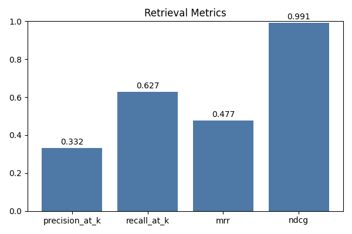
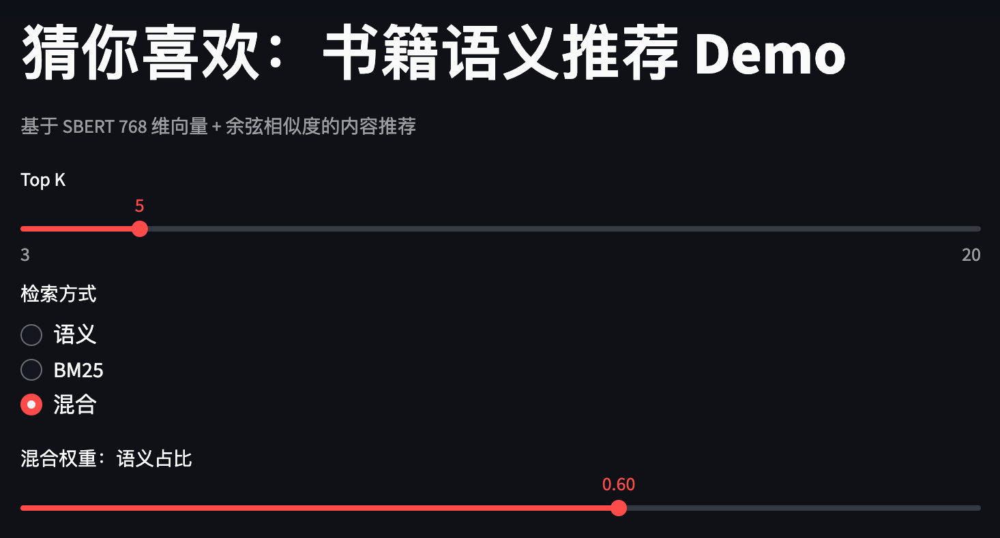
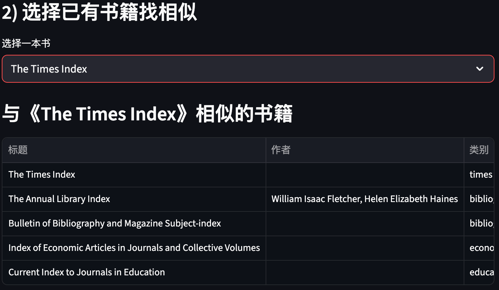
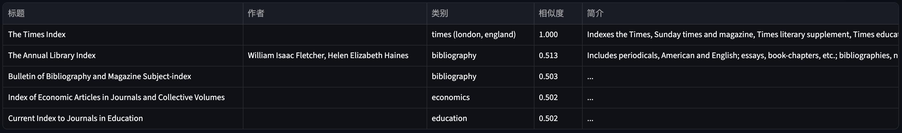

# 图书内容推荐系统作业报告


## 目录

---

[TOC]


## 项目地址

---

github链接：https://github.com/InftyMing/NTU-AAI-A6000-Book-Recommendation-System/tree/main


## 团队成员

---

孙铭（Email: MING005@e.ntu.edu.sg, StudentID: G2509034C）

高放（Email: FANG014@e.ntu.edu.sg, StudentID: G2509276D）


## 数据集

---

### 基本信息

- 来源：Kaggle `mihikaajayjadhav/books-dataset-15k-books-across-100-categories`
- 网址：https://www.kaggle.com/datasets/mihikaajayjadhav/books-dataset-15k-books-across-100-categories
- 获取：`kagglehub.dataset_download`，文件位于 `data/raw/google_books_dataset.csv`，共 15,147 条记录，21 个字段。
- 关键字段：`title`、`subtitle`、`authors`、`description`、`categories`、`average_rating`、`ratings_count`、`search_category`、`thumbnail` 等。


### 预处理细节

1) 去重：`book_id` 唯一去重。  
2) 缺失填充：`title/subtitle/authors/description/categories/search_category` 填空字符串并去首尾空格。  
3) 语义文本构造：`text = title + subtitle + description`，仅保留长度 > 50 的样本（降噪、避免极短描述）。  
4) 类别清洗：`categories` 用正则按 `| / , ;` 分割，小写化、去空白，得到 `category_list`，并抽取首类 `primary_category`。  
5) 保留字段：`book_id/title/subtitle/authors/description/categories/category_list/primary_category/text/average_rating/ratings_count/search_category`。  
6) 结果：有效样本 10,625 条，存储 `data/processed/books.parquet`。


## 模型与技术方案

---

- 语义编码：`sentence-transformers/all-mpnet-base-v2`（768 维）。  
  - 选型理由：在 STS/语义检索基准中表现优秀，容量适中，推理速度可接受；对英语长短文本都稳健。  
  - 未选模型：  
    - `all-MiniLM-L12-v2` 更轻但精度略低；  
    - 大型 LLM（如 text-embedding-3）需外部 API，成本与合规不利于本地部署；  
    - 多语言模型（如 `distiluse-base-multilingual-cased`) 对中文更友好，但本数据为英文书目，mpnet 精度更优。  
- 相似度：向量归一化 + FAISS `IndexFlatIP`（等价余弦相似度）。  
- 混合召回：BM25（`rank-bm25`）与语义向量融合，线性加权 `score = alpha*semantic + (1-alpha)*bm25`（默认 alpha=0.6）。  
- 评估：无监督近似指标（基于类别重叠）计算 precision@k、recall@k、MRR、nDCG，并生成图表。


## 流程与命令

---

一键跑全流程（预处理、向量、BM25、索引、评估+图）：

```bash
python -m src.pipeline --step all --sample-size 400 --k 5 --plot docs/metrics.png
# 如 Matplotlib 缓存无写权限，可：
MPLCONFIGDIR=/tmp/mplcache python -m src.pipeline --step all --sample-size 400 --k 5 --plot docs/metrics.png
```

步骤说明：
1) 预处理 → `data/processed/books.parquet`（10625 样本）。  
2) 向量化（batch=64）→ `data/processed/book_embeddings.npy`（约 31MB，10625×768）。  
3) 语义索引 → `data/index/books.faiss`。  
4) BM25 索引 → `data/index/bm25.pkl`。  
5) 评估 → 指标打印并保存图表 `docs/metrics.png`。


## 评估结果（k=5，采样 400）

---

- precision@k: **0.332**  

- recall@k: **0.627**  

- MRR: **0.477**  

- nDCG: **0.991**  

- category_coverage: **0.885**  

- 图表：

  
  解读：在无监督设定下，Top-5 中约 1/3 的结果与目标书籍共享类别；召回约 0.63，MRR 和 nDCG 说明前排质量较稳；类别覆盖接近 89%，评估基于有类别标签的样本。


## 性能与资源

---

- 环境：Apple Silicon（CPU）  
- 向量化 10k+ 样本约 1.5 分钟，吞吐 ~100 样本/秒（batch=64）。  
- 检索延迟：语义向量 + FAISS 内存索引，单查询毫秒级；BM25 亦为内存检索。  
- 占用：嵌入矩阵 ~32MB，FAISS 与 BM25 同量级，可常驻内存。


## 前端demo（本地展示）

---

### 运行

```bash
streamlit run app.py
```


### 功能说明

1. 检索模式：语义 / BM25 / 混合，可调混合权重。  

    

2. 自然语言搜索示例：“想看一本关于吸血鬼和校园恋爱的书”。  

    

3. 选书找相似：从书单（前 2000 条示例）选择一本，找相似书。  

    

4. 展示：标题、作者、类别、相似度、简介摘要。

    


## 代码要点

---

- `src/data_utils.py`：清洗/生成语义文本与类别列表。  
- `src/embedding_service.py`：SBERT 向量化（延迟导入 torch，避免无关步骤报错）。  
- `src/index_service.py`：FAISS 归一化 + 内积索引。  
- `src/bm25_service.py`：BM25 构建与检索，简单英文分词。  
- `src/evaluation.py`：precision/recall/MRR/nDCG + 类别覆盖。  
- `src/plot_utils.py`：指标柱状图。  
- `app.py`：前端集成混合召回与权重调节。


## 本地运行说明

---

```bash
# 预处理 + 向量 + 索引 + BM25
python -m src.pipeline --step all

# 仅检索示例
python - <<'PY'
import numpy as np
from src import config
from src.data_utils import load_processed
from src.embedding_service import EmbeddingService, load_embeddings
from src.index_service import load_index, search

df = load_processed(config.PROCESSED_PATH)
emb = load_embeddings(config.EMBEDDINGS_PATH)
index = load_index(config.INDEX_PATH)
model = EmbeddingService(model_name=config.MODEL_NAME).model
q = model.encode(["吸血鬼 校园 恋爱"], normalize_embeddings=True)
scores, idxs = search(index, q, top_k=5)
for score, idx in zip(scores[0], idxs[0]):
    print(f"{score:.3f}", df.iloc[idx]['title'])
PY
```


## 前景与改进

---

- 模型：可尝试多语言或蒸馏/对比微调；如需轻量部署可改 `all-MiniLM-L12-v2`，如需更高精度可用多塔蒸馏或更大 mpnet 变体。  
- 召回：可引入关键词规则、类别先验，多路融合可用学习到排序（LTR）替代线性加权。  
- 评估：若有用户行为数据，可转为监督指标（NDCG/Recall@K 基于点击/购买）；可构造 query-intent 人工标注集。  
- 体验：前端可增加过滤（类别/评分）、命中高亮、分页与缓存。  


## 总结

---

项目已实现从数据获取、清洗、语义与 BM25 混合召回、索引、无监督评估与可视化、以及本地前端展示的闭环。核心采用 SBERT 768 维表示 + FAISS 余弦检索，并以 BM25 融合提升覆盖与鲁棒性，可作为 RAG 检索层或内容推荐的基础模块。

